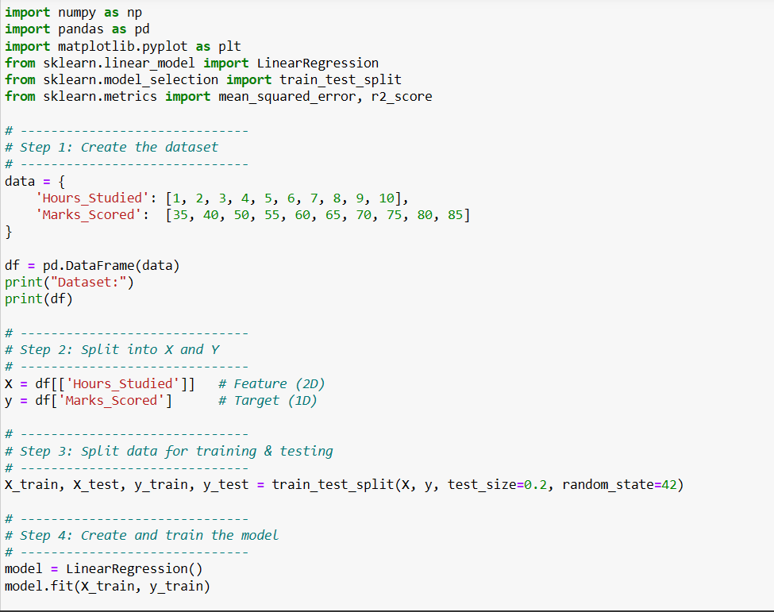
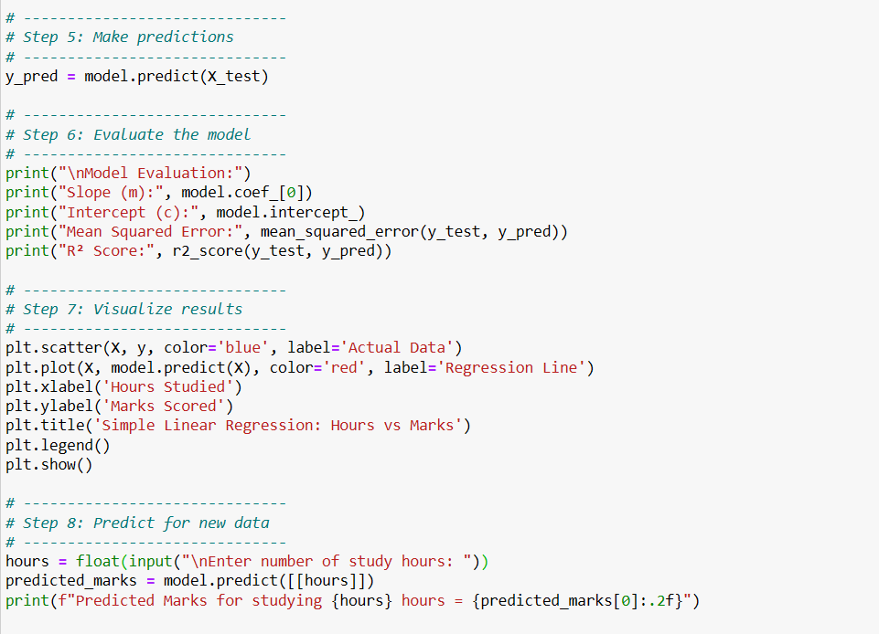
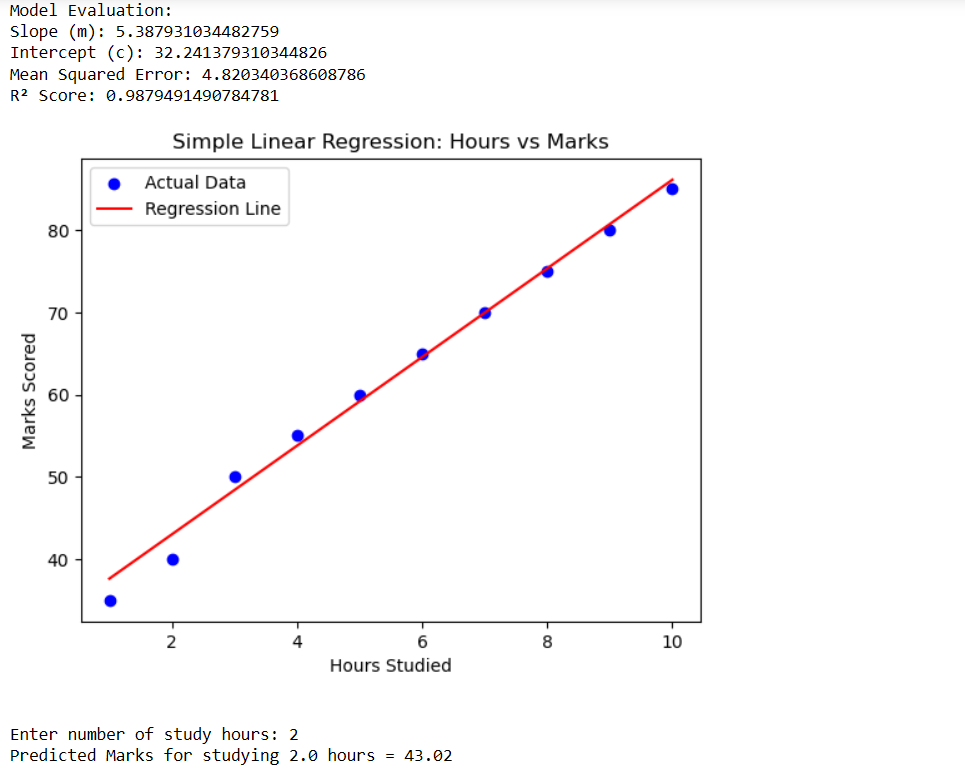

# Implementation-of-Simple-Linear-Regression-Model-for-Predicting-the-Marks-Scored

## AIM:
To write a program to predict the marks scored by a student using the simple linear regression model.

## Equipments Required:
1. Hardware – PCs
2. Anaconda – Python 3.7 Installation / Jupyter notebook

## Algorithm

1: Import the required libraries: numpy, matplotlib.pyplot, LinearRegression from sklearn.linear_model

2: Initialize the dataset: Assign values to independent variable X (hours studied) Assign values to dependent variable Y (marks scored)

3: Reshape the X data into a 2D array using reshape(-1,1)

4: Create the Linear Regression model: model = LinearRegression()

5: Train the model using the dataset: model.fit(X, Y)

6: Compute the slope (m) and intercept (b): m = model.coef_[0] b = model.intercept_

7: Form the regression equation: Y = mX + b

8: Accept user input for prediction: Read value of x_input (hours studied)

9: Predict the output using the model: predicted_value = model.predict([[x_input]])

10: Generate predicted values for all X: Y_pred = model.predict(X)

11: Plot the graph: Draw scatter plot for actual data points Draw regression line using predicted values

12: Display labels, title, legend and show the plot

## Program:
```
/*
Program to implement the simple linear regression model for predicting the marks scored.

import numpy as np
import pandas as pd
import matplotlib.pyplot as plt
from sklearn.linear_model import LinearRegression
from sklearn.model_selection import train_test_split
from sklearn.metrics import mean_squared_error, r2_score

# ------------------------------
# Step 1: Create the dataset
# ------------------------------
data = {
    'Hours_Studied': [1, 2, 3, 4, 5, 6, 7, 8, 9, 10],
    'Marks_Scored':  [35, 40, 50, 55, 60, 65, 70, 75, 80, 85]
}

df = pd.DataFrame(data)
print("Dataset:")
print(df)

# ------------------------------
# Step 2: Split into X and Y
# ------------------------------
X = df[['Hours_Studied']]   # Feature (2D)
y = df['Marks_Scored']      # Target (1D)

# ------------------------------
# Step 3: Split data for training & testing
# ------------------------------
X_train, X_test, y_train, y_test = train_test_split(X, y, test_size=0.2, random_state=42)

# ------------------------------
# Step 4: Create and train the model
# ------------------------------
model = LinearRegression()
model.fit(X_train, y_train)

# ------------------------------
# Step 5: Make predictions
# ------------------------------
y_pred = model.predict(X_test)

# ------------------------------
# Step 6: Evaluate the model
# ------------------------------
print("\nModel Evaluation:")
print("Slope (m):", model.coef_[0])
print("Intercept (c):", model.intercept_)
print("Mean Squared Error:", mean_squared_error(y_test, y_pred))
print("R² Score:", r2_score(y_test, y_pred))

# ------------------------------
# Step 7: Visualize results
# ------------------------------
plt.scatter(X, y, color='blue', label='Actual Data')
plt.plot(X, model.predict(X), color='red', label='Regression Line')
plt.xlabel('Hours Studied')
plt.ylabel('Marks Scored')
plt.title('Simple Linear Regression: Hours vs Marks')
plt.legend()
plt.show()

# ------------------------------
# Step 8: Predict for new data
# ------------------------------
hours = float(input("\nEnter number of study hours: "))
predicted_marks = model.predict([[hours]])
print(f"Predicted Marks for studying {hours} hours = {predicted_marks[0]:.2f}")

Developed by: Swathi P N
RegisterNumber:  212225230279
*/
```

## Output:







## Result:
Thus the program to implement the simple linear regression model for predicting the marks scored is written and verified using python programming.
